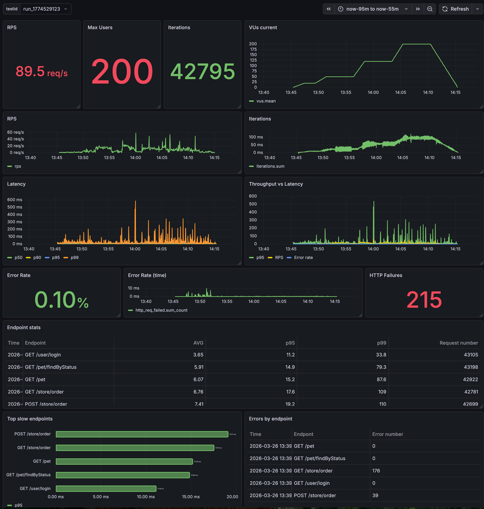

# Description

Performance testing tool: `k6` 
API: `swaggerapi/petstore` 
Database for storing data: `Influxdb` 
Performance test visualisation: `Grafana` 
 
Performance tests will be available for run in 4 modes: `smoke/load/stress/soak` 
You can also run tests with a specific `run ID`, which makes it easy to visualize information in Grafana 

# Steps
## Install k6
Follow the instructions provided in https://grafana.com/docs/k6/latest/set-up/install-k6/ 

## Setup Influx, Grafana and API
`docker-compose up -d` 
API will be available on `http://localhost:8080` 

## Prepare Influx
Influx will be available on `http://localhost:8086` without interface 
Create new db using `curl -XPOST "http://localhost:8086/query" --data-urlencode "q=CREATE DATABASE mydb"` 

## Prepare Grafana
You should be able to see Grafana dashboard on `http://localhost:3000` 
Its default username and password is: `admin` 
Create a data source with settings: `Query language - Influxdb`, `URL - http://influxdb:8086`, `Database - mydb` 
Create new dashboard using settings from `dashboard.json` as an example or any other dashboard 
For filtering by `run ID` create a `Variable` for the dashboard with request `SHOW TAG VALUES WITH KEY = "testid"` 

## Run tests
Run tests without run ID: 
`k6 run -e test_mode=<smoke/load/stress/soak> --out influxdb=http://localhost:8086/mydb test.js` 

Run tests with specific run ID: 
`TEST_RUN_ID=run_$(date +%s) k6 run -e test_mode=<smoke/load/stress/soak> --out influxdb=http://localhost:8086/mydb test.js` 

## Result monitoring in Grafafa
